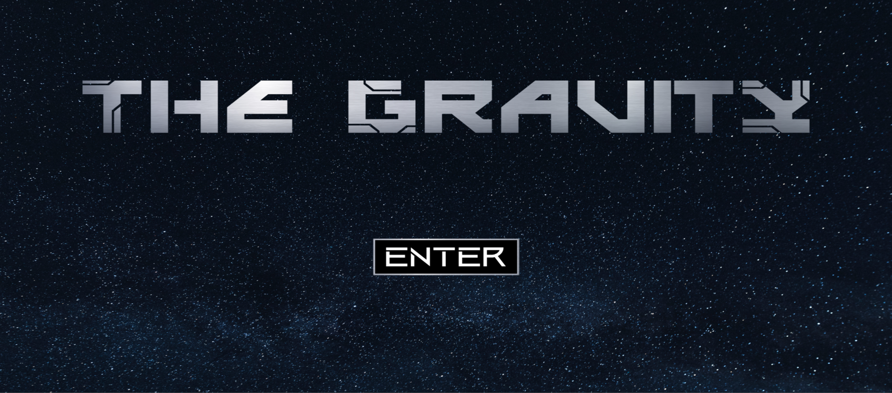

Acesso facilitado: https://openprocessing.org/sketch/2095943

Um simulador de gravidade entre a Terra e a lua feito em p5.js, no qual o usuário controla a Terra.

Feito como trabalho final da diciplina de MATEMÁTICA APLICADA À MULTIMÍDIA I.

